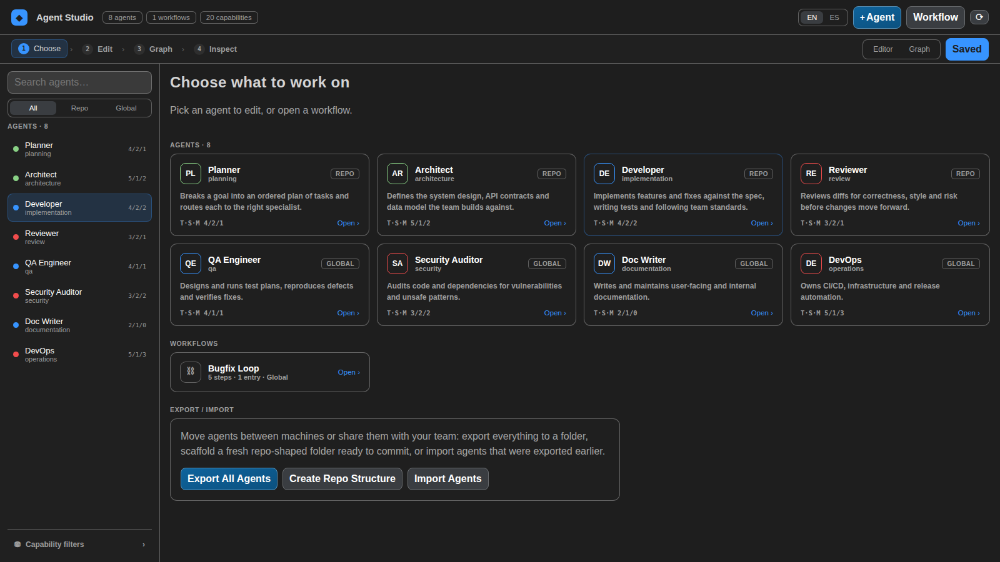
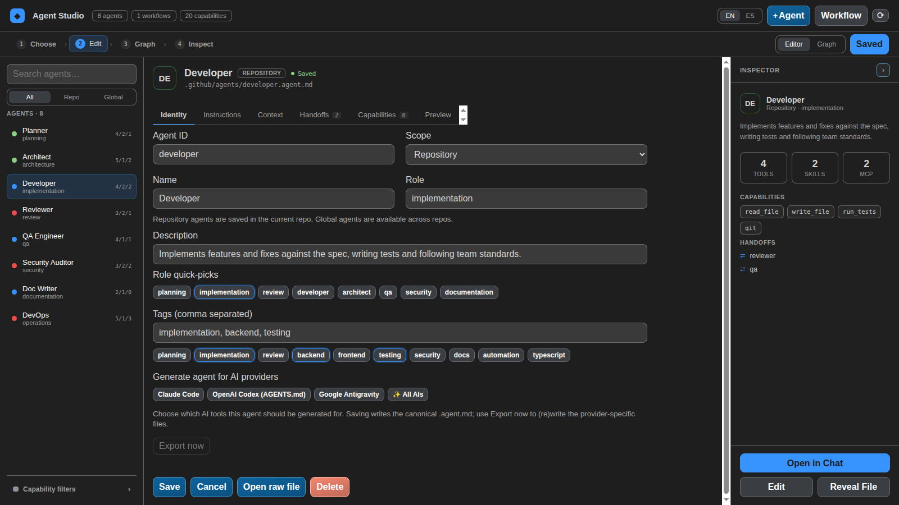
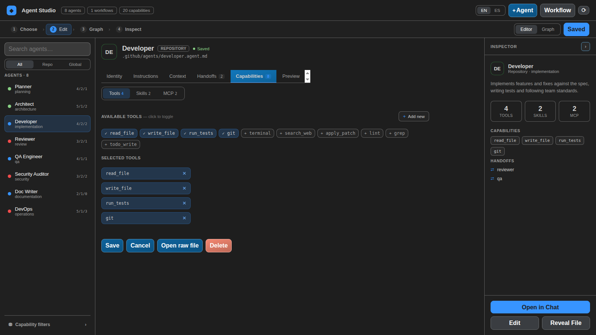
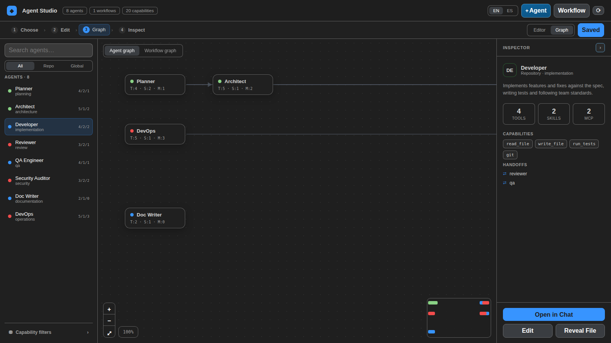
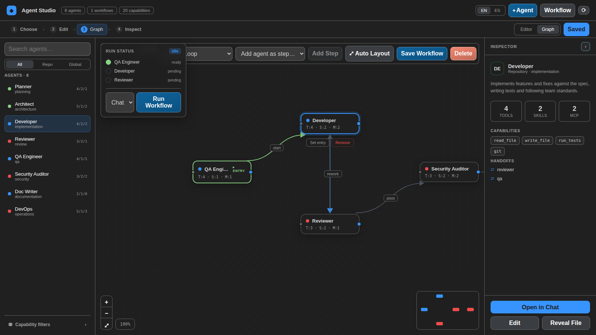
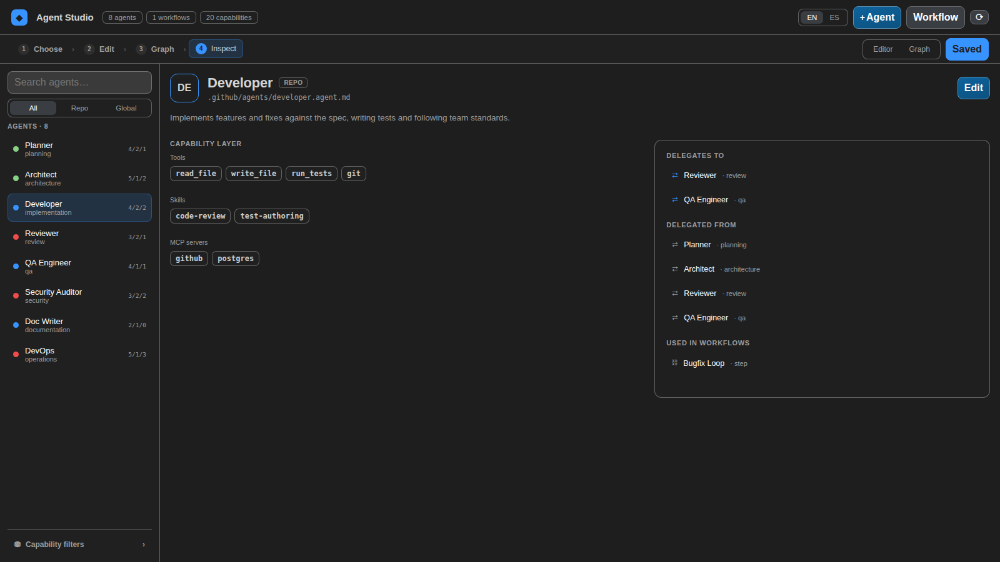
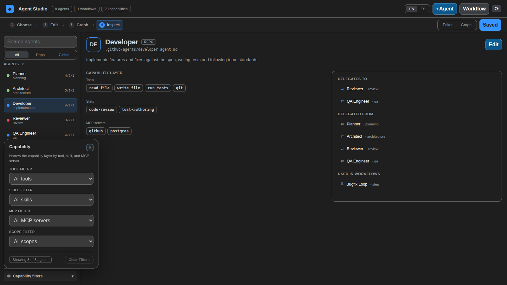

# Agent Studio

Create, manage, and orchestrate AI agents inside Visual Studio Code with a visual, developer-friendly control plane.

## Hero / Tagline

🚀 **Build multi-agent workflows without getting lost in config files.**  
Agent Studio gives you a visual dashboard to design agents, inspect relationships, and understand tools, skills, and MCP servers at a glance.

**CTA:** Install Agent Studio and run your agent ecosystem directly where you code.

## Features

### 🧠 Visual Agent Dashboard

- Manage agents from a dedicated VS Code sidebar and dashboard.
- Edit agent definitions with a clearer, structured workflow.
- Keep agent context close to your codebase.

### 🔗 Agent Relationships

- Visualize how agents connect and hand off work.
- Understand flow and dependencies faster in multi-agent setups.
- Reduce onboarding time for new teammates.

### ⚡ Tools, Skills, and MCP Visibility

- Inspect which tools, skills, and MCP servers each agent uses.
- Spot capability gaps and overlap quickly.
- Navigate from high-level architecture to implementation details.

### 🛠 Better DX Than Raw Config Files

- Move from scattered files to a guided in-editor experience.
- Discover, edit, and organize agents with less friction.
- Keep workflows readable as your system grows.

### 📍 Native VS Code Experience

- Works directly in your editor, alongside your project.
- Open agents in chat and move from design to execution quickly.
- No context switching to external dashboards.

### ⚙️ Native Workflow Execution Engine

- **Run Workflow** drives real CLI sessions — Claude CLI or Codex CLI — instead of pasting into VS Code's chat, chaining each step's output into the next.
- Independent nodes run **in parallel**, each in its own terminal (Claude) or `codex app-server` session (Codex), following the graph's real dependencies — parallel terminals now open **side by side in a real split**, not as separate tabs.
- **Human-in-the-loop handoffs**: mark any edge as `human` and approve, reject, or add instructions from a dedicated in-dashboard panel with full, unclipped context.
- **Live graph status**: nodes color and animate in real time — queued, running (pulsing), waiting on approval, completed, failed, skipped.
- A **safety preflight** blocks a run early if the selected CLI isn't installed, and warns only when the workspace has no Git repository at its root or in a direct child project — so a parent folder containing several repositories works as expected.
- A **Stop** button cancels an in-progress run without killing nodes mid-turn.
- Runs are **persisted and recoverable**: if VS Code closes mid-run, it's marked `interrupted` on next launch for inspection (never auto-resumed), and the Run status panel gets a history selector plus expandable objective/output per step.

### 🧩 Two/Four/Six-Pack Workflow Templates

- Start a new workflow from **Two-Pack**, **Four-Pack**, or **Six-Pack** — ready-made agent chains with sensible human handoffs, instead of a blank canvas.
- Only creates the agents you don't already have; existing agents with the same id are reused, never overwritten.

### 🌐 Interaction Language, Independent of the UI

- `agentStudio.interactionLanguage` controls what language agents respond in — separate from the dashboard's own display language — with an optional per-node override right in the graph editor.

### 🤖 Multi-AI Agent Generation

- Generate the same agent for **Claude Code**, **OpenAI Codex** (via `AGENTS.md`), or **Google Antigravity** from a single definition.
- Pick **✨ All AIs** to produce every provider's file in one step.
- Export (or re-export) any existing agent later from its context menu — see [Creating Agents](docs-site/docs/creating-agents.md#generating-agents-for-claude-codex-or-antigravity).

### 📦 Resource Repositories: Agents and Workflows Together

- **Create resource repository** creates a versionable library when it does not
  exist, with both canonical resource directories and a small README/manifest.
- **Export repository bundle** writes every loaded agent and workflow together
  into a repository you choose. Export is a merge, so files not managed by the
  current export remain untouched.
- **Import repository bundle** brings agents and workflow graphs in together,
  skips duplicate IDs, and reports invalid files or workflow references whose
  agents are not available locally.
- A created library becomes the configured global resource repository, so new
  global agents and workflows are saved back into the same Git-friendly folder.
- The canonical layout is `.github/agents/*.agent.md` and
  `.vscode/agent-studio/workflows/*.json`. Agent Studio also reads legacy
  `agents/*.md` and `workflows/*.json` from a configured library.

Workflows are also first-class resources in the dashboard: use the
**Agents / Workflows** rail to select a workflow directly, edit its name,
description, and scope, then compose, save, or run its graph.

## Prompts for AI-generated resources

Copy one of these prompts into any AI when you want it to generate a resource
that Agent Studio can import without manual repairs. Replace every
`<placeholder>` before sending it.

### Prompt: create an Agent Studio agent

```text
Create exactly one Agent Studio agent definition for this purpose:
<describe the responsibility, target repository, constraints, and the work it owns>

Return only two items, in this order:

1. The destination path and filename.
2. One complete .agent.md file in a fenced markdown code block.

Resource placement and identity contract:
- Scope is chosen by the destination, never written as sourceScope in the file:
  - repository scope: .github/agents/<agent-id>.agent.md
  - global shared-library scope: <resource-repository>/.github/agents/<agent-id>.agent.md
- agent-id is NOT a frontmatter field. Agent Studio derives it from `name` by
  lowercasing it, replacing every non-alphanumeric run with `-`, and trimming
  leading/trailing hyphens. Choose `name` so its derived id is exactly the
  desired lower-case kebab-case id. Example: "API Reviewer" => `api-reviewer`.
- Include valid YAML frontmatter delimited by `---`, followed by non-empty
  instructions as the Markdown body.
- Use only these provider IDs when applicable: `claude`, `codex`, `antigravity`.
  `providers` records intended targets; provider-specific export is a separate
  Agent Studio action.

Required frontmatter fields:
- name: human-readable, with a deterministic derived agent-id.
- description: one concise sentence explaining when to use the agent.
- role: short functional role, such as `reviewer` or `backend-engineer`.
- tags: list of lower-case discovery tags.
- providers: one or more allowed provider IDs.
- context: durable repository/domain context the agent needs before acting.
- handoffs: list of explicit next-agent contracts. Each item has `agent`
  (the target agent-id), `label`, `prompt`, and boolean `send`.
- capabilities:
  - tools is a YAML list of tool IDs. Agent Studio persists only tool IDs, not
    tool labels/kinds/descriptions, so use stable IDs such as `read_file`.
  - skills is a list of objects with `id`, `label`, and optional `description`.
  - mcp is a list of objects with `id`, `label`, optional `command`, optional
    string-array `args`, optional string-to-string `env`, and optional boolean
    `autoRunMCP`. Never place secrets, tokens, passwords, or private values in
    `env`; reference a documented environment-variable name instead.

Use this exact shape, replacing every placeholder. Keep empty capability or
handoff lists as `[]` rather than inventing values.

---
name: <Human-readable name whose slug is the desired agent-id>
description: <One-sentence purpose>
role: <functional-role>
tags:
  - <tag>
providers:
  - claude
  - codex
  - antigravity
context: >-
  <durable context, boundaries, relevant conventions, and expected outputs>
tools:
  - <tool-id>
skills:
  - id: <skill-id>
    label: <skill label>
    description: <optional concise description>
mcp:
  - id: <mcp-id>
    label: <MCP label>
    command: <optional executable command>
    args:
      - <optional argument>
    env:
      <ENVIRONMENT_VARIABLE_NAME>: <non-secret reference or value>
    autoRunMCP: false
handoffs:
  - agent: <target-agent-id>
    label: <short handoff label>
    prompt: <what the receiving agent must do with the result>
    send: true
---

<non-empty instructions in Markdown. Define the agent's goal, allowed work,
step-by-step method, quality checks, expected deliverable, and when to hand off.
Do not include an `id`, `sourcePath`, `sourceScope`, or `shadowedAgent` field.>
```

### Prompt: create an Agent Studio workflow

```text
Create exactly one Agent Studio workflow for this outcome:
<describe the outcome, the agents available by id, desired ordering/parallelism,
human approval gates, and the expected final deliverable>

Return only two items, in this order:

1. The destination path and filename.
2. One complete workflow JSON file in a fenced json code block.

Resource placement and identity contract:
- Scope is chosen by the destination, never written as sourceScope in JSON:
  - repository scope: .vscode/agent-studio/workflows/<workflow-id>.json
  - global shared-library scope:
    <resource-repository>/.vscode/agent-studio/workflows/<workflow-id>.json
- workflow.id and its filename must match and use only lowercase letters,
  numbers, and hyphens: `^[a-z0-9][a-z0-9-]*$`.
- name is required and description is optional but recommended.
- nodes is a non-empty array. Every node has a unique `id`, an `agentId` that
  exactly matches an existing Agent Studio agent-id, numeric `position.x` and
  `position.y`, and optional `languageOverride` (`en` or `es`). Exactly one
  node must have `isEntry: true`.
- edges is an array. Every edge has a unique `id`, and `source`/`target` values
  that refer to node IDs in this same workflow. Make a directed acyclic graph
  reachable from the entry node; do not create self edges or disconnected steps.
- `label` is optional. `handoff.mode` is `automatic` or `human`. Omit `handoff`
  or use `automatic` for immediate dispatch; use `human` only where a person
  must approve, reject, or add instructions before the target step starts.
- Do not include `sourcePath`, `sourceScope`, or `shadowedWorkflow`.

Use this exact JSON shape, replacing the placeholders. Preserve JSON syntax;
do not add comments or Markdown inside the JSON.

{
  "id": "<workflow-id-in-kebab-case>",
  "name": "<Human-readable workflow name>",
  "description": "<Concise purpose and expected outcome>",
  "nodes": [
    {
      "id": "<unique-node-id>",
      "agentId": "<existing-agent-id>",
      "position": { "x": 120, "y": 180 },
      "isEntry": true,
      "languageOverride": "es"
    },
    {
      "id": "<unique-node-id>",
      "agentId": "<existing-agent-id>",
      "position": { "x": 420, "y": 180 }
    }
  ],
  "edges": [
    {
      "id": "<unique-edge-id>",
      "source": "<entry-node-id>",
      "target": "<target-node-id>",
      "label": "<what is handed off>",
      "handoff": { "mode": "human" }
    }
  ]
}
```

## Screenshots


_Choose what to work on — agents, workflows, and a shared repository bundle in one screen._


_Agent Builder, Identity tab — Agent ID, Scope, Name, and Role in a single grid._


_Capabilities tab — toggle Tools/Skills/MCP servers, or add a new one on the fly._


_Agent graph — handoff relationships between agents, with the selected agent's connections highlighted._


_Workflow graph — steps, entry point, run status, and inline controls to add steps or run the workflow._


_Inspect view — an agent's capability layer, handoffs in/out, and the workflows it's used in._


_Capability filters — narrow the agent list by tool, skill, MCP server, or scope._

## Why Agent Studio?

If you are building with multiple AI agents, complexity grows fast. Agent Studio helps you stay in control.

- Clear visual model of your agent ecosystem.
- Faster debugging of orchestration issues.
- Better collaboration across teams.
- Reduced cognitive load versus manual configuration.

## Installation

### From VS Code Marketplace (recommended)

1. Open **Extensions** in VS Code.
2. Search for **Agent Studio**.
3. Select the extension and click **Install**.

### Manual install (VSIX)

1. Download the latest `.vsix` package from your release channel.
2. In VS Code, open the Command Palette.
3. Run **Extensions: Install from VSIX...** and select the file.

## Basic Usage

### Quick Getting Started

1. Open the **Agent Studio** icon in the Activity Bar.
2. Run **Agent Studio: Open Dashboard**.
3. Create your first agent with **Agent Studio: Create Agent** and choose whether it should be **Repository** or **Global**.
4. Add or inspect capabilities (tools, skills, MCP servers).
5. Create a workflow and connect agent steps visually.
6. Open an agent in chat and execute your flow.

### Typical first workflow

1. Create an agent for planning.
2. Create an agent for implementation.
3. Connect them in a workflow.
4. Validate capabilities from the dashboard inspector.
5. Launch from chat and iterate.

## Available Commands

- **Agent Studio: Open Dashboard**
- **Agent Studio: Quick Find Agent**
- **Agent Studio: Quick Find Workflow**
- **Agent Studio: Quick Find Capability**
- **Agent Studio: Create Agent**
- **Agent Studio: Edit Agent**
- **Agent Studio: Delete Agent**
- **Agent Studio: Duplicate Agent**
- **Agent Studio: Export Agent for Claude, Codex or Antigravity**
- **Agent Studio: Open Agent In Chat**
- **Agent Studio: Create Workflow**
- **Agent Studio: Start MCP Server**
- **Agent Studio: Focus Capability In Dashboard**
- **Agent Studio: Focus Workflow In Dashboard**
- **Agent Studio: Refresh Studio**
- **Agent Studio: Show Tools Guide**

## Configuration

Agent Studio supports workspace configuration for agent discovery paths.

- `agentStudio.agentPaths`: Additional workspace-relative directories to discover `.agent.md` files.
- `agentStudio.includeClaudeAgents`: When `true` (default), also discovers globally installed Claude Code subagents from `~/.claude/agents/*.md` and lists them as global agents.
- `agentStudio.resourceRepository`: Optional path to a shared Agent Studio repository. Its resources are available globally and new global agents/workflows are saved there. It is set automatically by **Create resource repository**.
- `agentStudio.interactionLanguage`: Default language (`en`/`es`, default `en`) agents are asked to respond in during a workflow run — independent of the dashboard's own display language. Individual workflow nodes can override this from the graph editor.
- `agentStudio.cli.claudeCommand`: Command used to launch the Claude CLI interactively in each workflow node's terminal (default `claude --permission-mode acceptEdits`). Override for a wrapper (e.g. a shell alias like `claude-with-memory`) or different flags.
- `agentStudio.cli.codexCommand`: Command used to launch the Codex CLI interactively (default `codex --sandbox workspace-write --no-alt-screen`).
- `agentStudio.cli.startupDelayMs`: Milliseconds to wait after launching a CLI before typing the prompt into it (default `3000`).

### Agent scopes

Agent Studio supports two storage scopes for agents:

- `repository`: stored in the current repo, under `.github/agents`
- `global`: stored in the current user's home directory, either under `~/.agents/agents` (Agent Studio's own format) or `~/.claude/agents` (Claude Code subagents, read-only frontmatter shape — `tools` may be a comma-separated string instead of an array)

When Agent Studio loads agents, it merges:

- repository agents from the open workspace
- global agents from `~/.agents/agents`
- global Claude Code subagents from `~/.claude/agents` (unless `agentStudio.includeClaudeAgents` is set to `false`)

The dashboard's agent picker and search results show a `Repo`/`Global` badge next to each agent so you can tell scopes apart at a glance, and you can filter the agent list by scope from the Capability Filters panel.

If two agent files resolve to the same agent id, the later one in the merge order above wins (repository beats global, and `~/.claude/agents` beats `~/.agents/agents`). The shadowed agent is dropped from the list, and Agent Studio surfaces a warning in the Inspector panel, the sidebar tree tooltip, and the developer console so the conflict isn't silent.

You can choose the scope:

- when creating a new agent from the command palette
- from the `Scope` field in the Agent Builder `Identity` tab

Editing and saving works the same way for both scopes — saving writes back to the folder matching the agent's `Scope` field (and migrates the file there if it was loaded from elsewhere, e.g. from `~/.claude/agents`).

Default:

```json
{
  "agentStudio.agentPaths": [".github/agents"],
  "agentStudio.includeClaudeAgents": true
}
```

### Sample data seeding

By default, Agent Studio does not create any files automatically.

If you want starter sample agents and a sample workflow in an empty workspace, enable the `agentStudio.seedSampleData` setting:

```json
{
  "agentStudio.seedSampleData": true
}
```

## Donations

Hey there, fellow adventurer! 🐾

If you'd like to support Agent Studio, you can make a small contribution at https://buymeacoffee.com/eric92rodrm.

Your donations help keep the project alive — covering hosting, infrastructure and maintenance so the dashboard and related services stay online and responsive. Any remaining funds will be used to provide food, supplies, and shelter for animals in need.

Thank you for your generosity—you're making a difference both for this project and for real-life companions. Together we protect our pets, digital and furry alike! 💖

## Roadmap

Shipped in 2.0.0: real CLI-driven workflow execution, parallel per-agent terminals/sessions, human-in-the-loop handoffs, live graph run status, safety preflight, Two/Four/Six-Pack templates, and run state persistence/recovery across VS Code restarts.

Shipped in 2.1.0: real side-by-side terminal splitting for parallel nodes, the `⚡` icon on automatic handoff edges, a reliable in-dashboard preflight warning for non-git workspaces, and an automated test suite (`npm test`). No open bugs from the workflow engine remain as of this release.

Shipped in 2.1.1: the preflight now recognizes a Git repository in a direct child project, so opening a folder that groups multiple independent repositories does not produce a false warning.

Planned improvements include:

- Richer validation and diagnostics for agent setups.
- Expanded templates for common agent architectures.
- Enhanced observability for multi-agent execution.

## Contributing

Contributions are welcome. For contribution guidelines, issue reporting, and collaboration flow, check the project documentation and open a pull request.

## License

MIT License. See [LICENSE](LICENSE) for details.

## Frontmatter & Agent File Format (developer notes)

Agent Studio uses a structured frontmatter in `.agent.md` files to declare capabilities and handoffs. Recent updates changed a few rules — update your `.agent.md` files accordingly.

- `tools`: now serialized as an array of tool IDs (strings). Example:

```yaml
tools:
  - run_in_terminal
  - apply_patch
```

- `mcp`: an array of MCP server objects or ids. MCP objects may include an optional `autoRunMCP` boolean. Example:

```yaml
mcp:
  - id: chrome-devtools-mcp
    command: npx
    args:
      ["chrome-devtools-mcp@0.21.0", "--browserUrl", "http://127.0.0.1:9222"]
    autoRunMCP: true
```

- `handoffs`: migrated from an array of agent-id strings to objects with `agent`, optional `label`, optional `prompt`, and optional `send` boolean. Strings are still accepted and will be migrated on save. Example:

```yaml
handoffs:
  - agent: reviewer
    label: Reviewer
    prompt: "Please review the changes and focus on tests"
    send: true
```

Validation: Agent Studio will log/notify when it discovers older formats and offer migration guidance.
