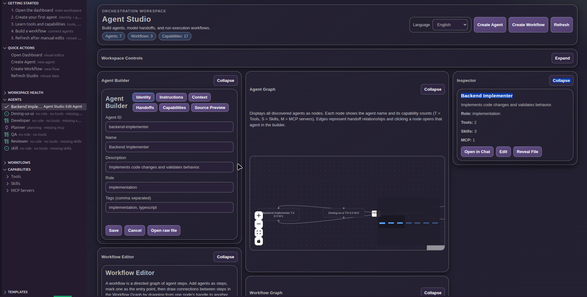
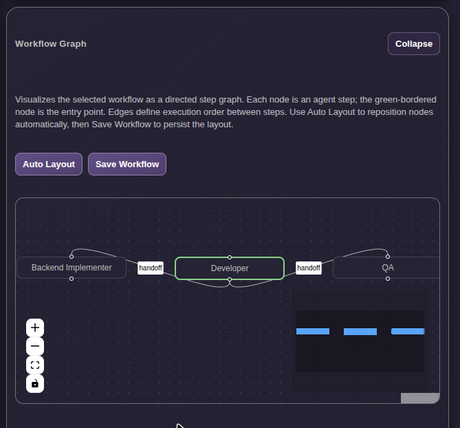
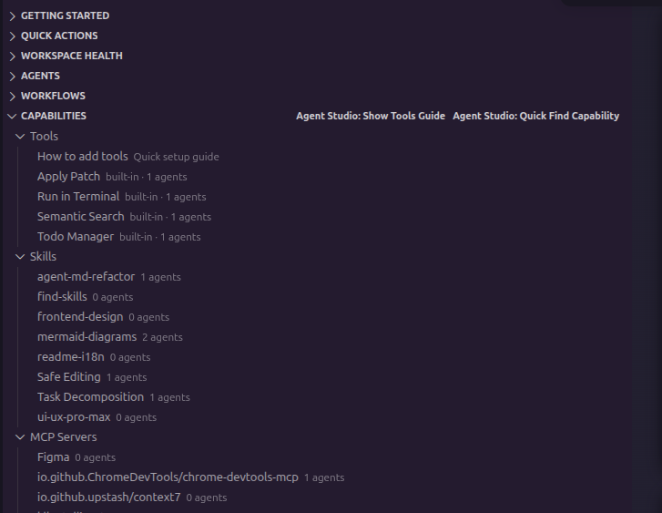

# Agent Studio

Create, manage, and orchestrate AI agents inside Visual Studio Code with a visual, developer-friendly control plane.

## Hero / Tagline

🚀 **Build multi-agent workflows without getting lost in config files.**  
Agent Studio gives you a visual dashboard to design agents, inspect relationships, and understand tools, skills, and MCP servers at a glance.

**CTA:** Install Agent Studio and run your agent ecosystem directly where you code.

## Features

### 🧠 Visual Agent Dashboard

- Manage agents from a dedicated VS Code sidebar and dashboard.
- Edit agent definitions with a clearer, structured workflow.
- Keep agent context close to your codebase.

### 🔗 Agent Relationships

- Visualize how agents connect and hand off work.
- Understand flow and dependencies faster in multi-agent setups.
- Reduce onboarding time for new teammates.

### ⚡ Tools, Skills, and MCP Visibility

- Inspect which tools, skills, and MCP servers each agent uses.
- Spot capability gaps and overlap quickly.
- Navigate from high-level architecture to implementation details.

### 🛠 Better DX Than Raw Config Files

- Move from scattered files to a guided in-editor experience.
- Discover, edit, and organize agents with less friction.
- Keep workflows readable as your system grows.

### 📍 Native VS Code Experience

- Works directly in your editor, alongside your project.
- Open agents in chat and move from design to execution quickly.
- No context switching to external dashboards.

## Screenshots

> Replace these placeholders with real captures before Marketplace publication.


_Visual Agent Dashboard (placeholder)_


_Agent relationships and workflow graph (placeholder)_


_Tools, Skills, and MCP visibility (placeholder)_

## Why Agent Studio?

If you are building with multiple AI agents, complexity grows fast. Agent Studio helps you stay in control.

- Clear visual model of your agent ecosystem.
- Faster debugging of orchestration issues.
- Better collaboration across teams.
- Reduced cognitive load versus manual configuration.

## Installation

### From VS Code Marketplace (recommended)

1. Open **Extensions** in VS Code.
2. Search for **Agent Studio**.
3. Select the extension and click **Install**.

### Manual install (VSIX)

1. Download the latest `.vsix` package from your release channel.
2. In VS Code, open the Command Palette.
3. Run **Extensions: Install from VSIX...** and select the file.

## Basic Usage

### Quick Getting Started

1. Open the **Agent Studio** icon in the Activity Bar.
2. Run **Agent Studio: Open Dashboard**.
3. Create your first agent with **Agent Studio: Create Agent**.
4. Add or inspect capabilities (tools, skills, MCP servers).
5. Create a workflow and connect agent steps visually.
6. Open an agent in chat and execute your flow.

### Typical first workflow

1. Create an agent for planning.
2. Create an agent for implementation.
3. Connect them in a workflow.
4. Validate capabilities from the dashboard inspector.
5. Launch from chat and iterate.

## Available Commands

- **Agent Studio: Open Dashboard**
- **Agent Studio: Quick Find Agent**
- **Agent Studio: Quick Find Workflow**
- **Agent Studio: Quick Find Capability**
- **Agent Studio: Create Agent**
- **Agent Studio: Edit Agent**
- **Agent Studio: Delete Agent**
- **Agent Studio: Duplicate Agent**
- **Agent Studio: Open Agent In Chat**
- **Agent Studio: Create Workflow**
- **Agent Studio: Start MCP Server**
- **Agent Studio: Focus Capability In Dashboard**
- **Agent Studio: Focus Workflow In Dashboard**
- **Agent Studio: Refresh Studio**
- **Agent Studio: Show Tools Guide**

## Configuration

Agent Studio supports workspace configuration for agent discovery paths.

- `agentStudio.agentPaths`: Additional workspace-relative directories to discover `.agent.md` files.

Default:

```json
{
  "agentStudio.agentPaths": [".github/agents"]
}
```

### Sample data seeding

By default, Agent Studio does not create any files automatically.

If you want starter sample agents and a sample workflow in an empty workspace, enable the `agentStudio.seedSampleData` setting:

```json
{
  "agentStudio.seedSampleData": true
}
```

## Donations

Hey there, fellow adventurer! 🐾

If you'd like to support Agent Studio, you can make a small contribution at https://buymeacoffee.com/eric92rodrm.

Your donations help keep the project alive — covering hosting, infrastructure and maintenance so the dashboard and related services stay online and responsive. Any remaining funds will be used to provide food, supplies, and shelter for animals in need.

Thank you for your generosity—you're making a difference both for this project and for real-life companions. Together we protect our pets, digital and furry alike! 💖

## Roadmap

Planned improvements include:

- More advanced workflow orchestration controls.
- Richer validation and diagnostics for agent setups.
- Expanded templates for common agent architectures.
- Enhanced observability for multi-agent execution.

## Contributing

Contributions are welcome. For contribution guidelines, issue reporting, and collaboration flow, check the project documentation and open a pull request.

## License

MIT License. See [LICENSE](LICENSE) for details.
